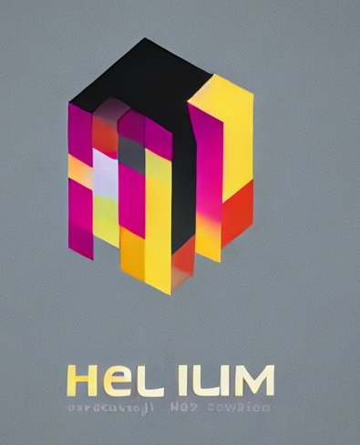

# Cubist.Helium



A small and simple no guardrails html generator library for .NET 6+

## What is does

Helium makes generating snippets of well-formed html easy.

Start by statically importing the class that gave this library its name 
so that your html snippets will look nice and clean.:

```C#
using static Cubist.Helium.He;
```
Then use the static methods of the `He` class to build your snippets of html.

```C#
var doc = Document(
            Head(
                Title("Hello, World!")),
            Body(
                H1("Hello, World!")));

```
and render it to a string.
```C#
var html = doc.ToString();
```
Or write it to a `TextWriter`
```C#
doc.WriteTo(Console.Out);
```
This will render the following html:
```html
<!DOCTYPE html><html><head><title>Hello, World!</title></head><body><h1>Hello, World!</h1></body></html>
```

Make it nicer to read using `PrettyPrint()`...
```C#
var html = doc.PrettyPrint();
// Or write it to a TextWriter
doc.PrettyPrintTo(Console.Out);
```
Aaaahhh, much better...
```html
<!DOCTYPE html>
<html>
<head>
  <title>Hello, World!</title>
</head>
<body>
  <h1>Hello, World!</h1>
</body>
</html>
```

### A little more complicated

Now witness the power of this fully equipped and operational library!

```C#
using static Cubist.Helium.He;

var items = new object[] { "some text", 1, DateTime.Now, };
var list = Ul(items.Select(item => Li(TemplateFor(item))));
var html = list.PrettyPrint();

Node TemplateFor(object item) => item switch
{
    int i => Div("A number: ", Data(i, "The number " + i)),
    string s => Div("Some text: ", Q(Span(("style", "font-style: italic;"), s))),
    DateTime dt => Div("A date-time: ", Time(dt, dt.ToString("M"))),
    _ => Div("Some data: ", CData(item)),
};
```
Renders to:
```html
<ul>
  <li>
    <div>Some text: <q><span style="font-style: italic;">some text</span></q></div>
  </li>
  <li>
    <div>A number: <data value="1">The number 1</data></div>
  </li>
  <li>
    <div>A date-time: <time datetime="2023-03-06 17:19:28Z">6 maart</time></div>
  </li>
</ul>
```


## What did just happen?

Most elements take a params array of objects as content, for example: 

```C#
public static He Div(params object[] content) => new(Tags.Div) { content };
```

The content objects are interpreted as follows:

* Any two-element tuple is interpreted as an HTML attribute. e.g. `Div(("tabindex", 1))` renders as `<div tabindex="1"></div>`  
* Ordering of attributes relative to child elements does not matter, `Div(("tabindex", 1), "content")` and `Div("content",("tabindex", 1))` both render as `<div tabindex="1">content</div>` 
* The order of attributes relative to other attributes is kept. 
  `Div(("class","highlight"), ("tabindex", 1))` renders as `<div class="highlight" tabindex="1"></div>`
  and `Div(("tabindex", 1), ("class","highlight"))` renders as `<div tabindex="1" class="highlight"></div>`

### Type conversions during element construction

See `He.Add(object? content)` for the nitty-gritty details.

* Any two-element tuple is added to the element's attribute list as `(string, object?)` tuple, converting the first element to a string if it's not one.
* Any string content is added as a child `Text` node, and written as-is to the output. `Div("some text")` becomes `<div>some text</div>`
  and `Div("<div></div>")` will render as `<div><div></div></div>`. This is the no guardrails part...
* Any content that is a .NET primitive type uses the `ToString()` method of the content and is added as a child `Text` node
* Any content that implements `IEnumerable` will be added as a range of nodes. (This can be a mixed list of attribute tuples, `Node`s, primitive types, etc...).
* Any content that does not derive from `Node` or is not a .NET primitive type uses the `ToString()` of the content and is added as a `CData` node.


For more examples see the [Cubist.Helium.Examples](./Cubist.Helium.Examples/README.md) project.